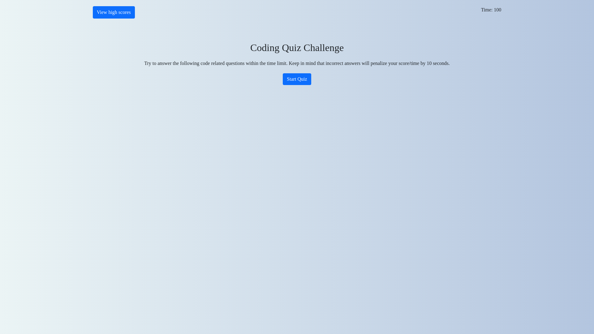

# Coding Quiz Application

## Description

A typical coding assessment with a combination of multiple-choice questions and interactive coding challenges.A technical assessment is a coding test that mirrors the real world work of a computer engineer at a company and asks the job applicant to complete a series of coding exercises in a developer environment that tests their skills as a programmer.

## Deployed Website

<https://shanebramble.github.io/coding-quiz>

### Built With

* HTML
* CSS
* JavaScript
* Bootstrap

## Contribution

Made with ❤️ by Shane Bramble-Wade

### ©️2021 Coding-Quiz, Inc
